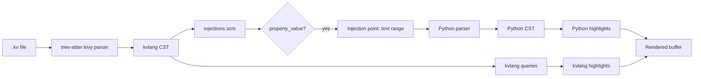

# Design: Python Injection in Property Values

## Technical Approach

Add a tree-sitter language injection query targeting `property_value` nodes, re-parsing their full text range as Python. Zero grammar changes — pure additive query file plus one config key in `tree-sitter.json`.

## Architecture Decisions

| Decision | Choice | Alternatives | Rationale |
|----------|--------|-------------|-----------|
| Injection vs grammar change | Pure injection query | Extending grammar.js with Python token embedding | Zero risk: no grammar re-compilation, no test corpus changes, no WASM rebuild needed. Tree-sitter injection queries are the established pattern for cross-language highlighting (HTML+JS, JSX, etc.) |
| `include-children` | `true` | Omitting it (default false) | Without this, tree-sitter only re-parses the **first child** node's text range. `property_value` is a `seq(...)` with children (string, number, tuple, etc.) — without `include-children`, only the leading child would be injected, not the full expression |
| Target node | `property_value` | `property` or `event_binding` | Both `property.value` and `event_binding.handler` use `$.property_value` as their field. Targeting the shared rule covers both use cases with **one** query pattern. Avoiding per-context duplication |
| Injection scope | ALL `property_value` | Selective by parent context | Kivy property values are always Python expressions by design. There are no `property_value` nodes that should **not** be injected. No exceptions needed |
| Query file registration | `tree-sitter.json` `injections` key | — | Tree-sitter requires all query types to be registered in the grammar config. Without this key, editors do not discover the injection file |

## Data Flow



Injection is orthogonal — the kvlang CST and Python CST coexist as separate parse layers. No conflict, no override.

## File Changes

| File | Action | Description |
|------|--------|-------------|
| `queries/injections.scm` | Create | Single-pattern injection query mapping `property_value` → Python |
| `tree-sitter.json` | Modify | Add `"injections": ["queries/injections.scm"]` to kivy grammar entry |

## Interfaces / Contracts

**Injection query** (`queries/injections.scm`):

```scm
((property_value) @injection.content
 (#set! injection.language "python")
 (#set! injection.include-children))
```

**Config change** (`tree-sitter.json`):

```json
{
  "grammars": [{
    "name": "kivy",
    "injections": ["queries/injections.scm"]
  }]
}
```

## Testing Strategy

| Layer | What to Test | Approach |
|-------|-------------|----------|
| Regression | No grammar breakage | `tree-sitter test` — existing corpus must pass unchanged |
| Build | WASM compilation | `tree-sitter build --wasm` — must succeed with new query file |
| Manual | Python highlighting in .kv | Open a `.kv` with `color: (1, 0, 0, 1)` and verify Python highlighting activates |

No unit tests needed — zero grammar changes. The injection is a static query file validated at editor load time.

## Threat Matrix

N/A — no routing, shell commands, subprocesses, VCS/PR automation, executable-file classification, or process-integration boundary. Pure query file change.

## Migration / Rollout

No migration required. Addition of an injection query is purely additive — existing kvlang functionality is completely unaffected. Rollback: revert `tree-sitter.json` and delete `queries/injections.scm`.

## Open Questions

None. Design is fully resolved.
